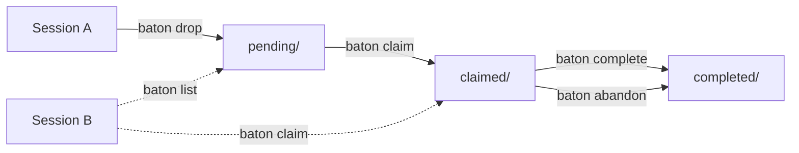

# BATON — Inter-Session Coordination

**Status:** 🔄 Phase 2 — CLI operational, registry + spawn planned
**Location:** `baton/`

BATON enables AI agents and sessions to hand off context, tasks, and results to each other — across WSL instances, platforms, and time boundaries.

## Current State (Phase 2)

The BATON CLI is fully operational. Batons are shared via `/mnt/c/Temp/wsl-shared/baton/` — accessible from all WSL instances on the same Windows host.

```bash
# Drop a task for any session to pick up
baton drop "Subject line" [--to session] [--type task|handoff|alert] [--priority high|normal|low] [--body "..."] [--ref session-id]

# List pending batons
baton list [--all]

# Claim a baton (pending → claimed)
baton claim <id-prefix>

# Mark a claimed baton done
baton complete <id-prefix> [--result "..."]

# Inspect any baton
baton show <id-prefix>

# Abandon (pending or claimed → completed/abandoned)
baton abandon <id-prefix>
```

`baton` is symlinked to `~/.local/bin/baton` on every deploy.

## Baton Packet Format

```json
{
  "id": "uuid-v4",
  "created": "2026-03-14T00:00:00.000Z",
  "from": "ai-stack",
  "to": "any",
  "type": "task",
  "priority": "normal",
  "subject": "One-line summary",
  "body": "Full description and acceptance criteria",
  "context": {
    "chronicle_refs": ["session-id-prefix"],
    "inline": ""
  },
  "status": "pending",
  "claimed_at": null,
  "claimed_by": null,
  "completed_at": null,
  "result": null
}
```

### Field reference

| Field | Values | Notes |
|-------|--------|-------|
| `from` | session name or `"user"` | Auto-detected from active Claude Code session |
| `to` | session name or `"any"` | `"any"` = first claimer wins |
| `type` | `task`, `handoff`, `alert` | `alert` = FYI only, no claim needed |
| `priority` | `high`, `normal`, `low` | `high` sorts to top of `baton list` |
| `context.chronicle_refs` | session ID prefixes | Receiver reads these for context before starting |

## Shared Store Layout

```
/mnt/c/Temp/wsl-shared/baton/
├── pending/     — available to claim
├── claimed/     — in progress
└── completed/   — done or abandoned
```

## Flow Diagram



## Roadmap

| Phase | Item | Status |
|-------|------|--------|
| Phase 2 | `baton.sh` CLI — drop/list/claim/complete/show/abandon | ✅ Done |
| Phase 2 | Shared file store (`/mnt/c/Temp/wsl-shared/baton/`) | ✅ Done |
| Phase 2 | `~/.local/bin/baton` symlink via CI/CD | ✅ Done |
| Phase 3 | Session registry (`registry.json`) — live session index | ⬜ Planned |
| Phase 3 | `baton-send` / `baton-result` — messaging integration | ⬜ Planned |
| Phase 3 | Heartbeat-driven registry updates | ⬜ Planned |
| Phase 4 | `baton-spawn` — launch new sessions headlessly | ⬜ Planned |
| Phase 4 | Orchestrator intelligence — decompose + parallel spawn | ⬜ Planned |
| Phase 5 | Cedar RBAC policies on baton routing | ⬜ Planned |

## Integration Points

| Component | BATON Integration |
|-----------|-----------------|
| CHRONICLE | Batons reference session IDs (`chronicle_refs`) for context |
| Telegram | Bot can surface pending batons; drop batons via `/baton` command |
| Heartbeat | Will update session registry when sessions go active/idle |
| CI/CD | `baton` symlink registered on every deploy |
