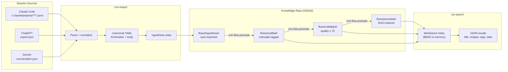

# CHRONICLE — Session Archive and Knowledge Curation

**Status:** ✅ Production
**Location:** `chronicle/`
**Package:** `rtgf-chronicle`

Git-native LLM conversation archival with knowledge flow states, multi-platform adapters, and semantic search.

## How It Works



## Canonical Session Format

Sessions are stored as Markdown files with YAML frontmatter:

```yaml
---
id: "a1b2c3d4-..."
title: "Implement LiteLLM gateway routing"
platform: claude-code
date: "2026-03-05T14:22:01Z"
flow_state: codified
tags: [litellm, gateway, routing, docker]
quality_score: 82
repo: intenx-knowledge
client: intenx
---

## Session Summary
...session content...
```

## CLI Tools

| Command | Description |
|---------|-------------|
| `rcm-import --source <jsonl> --platform claude-code --target <repo>` | Import a Claude Code session |
| `chronicle-import-chatgpt <conversations.json> <repo>` | Import ChatGPT export |
| `chronicle-import-gemini <takeout.json> <repo>` | Import Gemini Takeout |
| `ctx-search "<query>" --format json --recent 5` | Search sessions |
| `rcm-flow promote --session <id> --to codified --tags "topic"` | Advance knowledge flow state |
| `rcm-find-orphans --target <repo> --import` | Find and import missed sessions |

## Daily Import Cron

Two crons work together to keep the knowledge base current:

```
# Dev WSL (INTenXDev) — crontab -e
PATH=/home/<user>/.nvm/versions/node/v22.x.x/bin:/home/<user>/.local/bin:/usr/local/bin:/usr/bin:/bin
0 2 * * * ~/rtgf-ai-stack/chronicle/cron-daily-import.sh >> ~/logs/chronicle-import-cron.log 2>&1

# AI Hub WSL — crontab -e  (pulls GitHub so ctx-search sees new sessions)
30 2 * * * ~/rtgf-ai-stack/chronicle/cron-hub-pull.sh >> ~/logs/chronicle-hub-pull-cron.log 2>&1
```

The import cron scans `~/.claude/projects/` for JSONL files modified in the last 24 hours, imports new sessions, and pushes to GitHub. The Hub pull cron runs 30 minutes later.

## Multi-Platform Adapters

| Platform | Script | How to export |
|----------|--------|---------------|
| Claude Code | auto via cron | `~/.claude/projects/**/*.jsonl` |
| ChatGPT | `chronicle-import-chatgpt` | ChatGPT Settings → Data controls → Export data |
| Gemini | `chronicle-import-gemini` | [takeout.google.com](https://takeout.google.com) → Gemini Apps Activity |

All adapters produce `.md` files with YAML frontmatter — compatible with ctx-search BM25 indexing.

## Telegram Integration

The `/chronicle` command in the Telegram bot uses `ctx-search` to search the knowledge archive:

```
/chronicle LiteLLM gateway setup
```

Returns matching session titles, tags, flow state, date, and repo.
