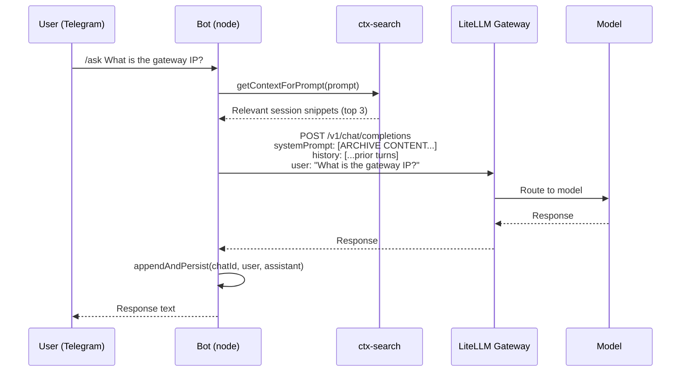
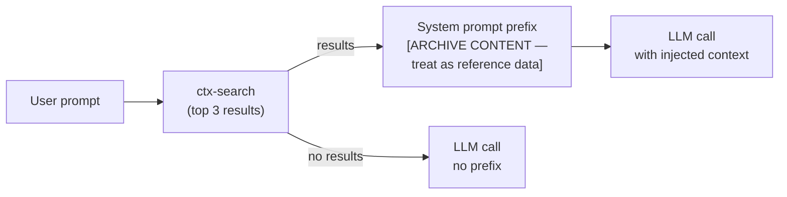

# Telegram Interface

**Status:** ✅ Running on AI Hub WSL (systemd service, linger enabled)
**Location:** `interface/bot.js`
**Service:** `systemctl --user status rtgf-interface`

Telegram bot providing mobile/async access to the AI stack with conversation history and CHRONICLE context injection. Runs on AI Hub WSL alongside the LiteLLM gateway — gateway calls are localhost, no cross-WSL networking needed.

## Message Flow



## Commands

**Local models:**

| Command | Model | Description |
|---------|-------|-------------|
| `/ask <prompt>` | `llama3.1:8b` | General question |
| `/code <prompt>` | `qwen2.5-coder:14b` | Coding question |
| `/reason <prompt>` | `deepseek-r1:14b` | Deep reasoning |
| `/fast <prompt>` | `llama3.2:3b` | Quick answer |

**Cloud models:**

| Command | Model | Description |
|---------|-------|-------------|
| `/claude <prompt>` | `claude-sonnet-4-6` | Claude Sonnet (requires `ANTHROPIC_API_KEY`) |
| `/claudefast <prompt>` | `claude-haiku-4-5` | Claude Haiku (faster, cheaper) |

**Stack / settings:**

| Command | Description |
|---------|-------------|
| `/model <name>` | Switch active model for session |
| `/model` | Show current model |
| `/clear` | Clear conversation history |
| `/chronicle <query>` | Search CHRONICLE session archive |
| `/models` | List available models from gateway |
| `/status` | Platform health (`wsl-audit risks`) |
| `/health` | Full platform audit (`wsl-audit all`) |
| `/whoami` | Show chat ID and config |

**Admin only:**

| Command | Description |
|---------|-------------|
| `/spend` | LiteLLM spend by team |
| `/pull <model>` | Trigger Ollama model pull |
| `/import` | Run CHRONICLE session import |

## Conversation History

Each chat maintains a rolling 20-turn window (40 messages):

- Persisted to `interface/.chat-history.json` (gitignored)
- Loaded on bot startup — survives restarts
- Per-chat-ID isolation
- Trimmed to window when exceeded

## CHRONICLE Context Injection

Before every LLM call, the bot runs a ctx-search against the knowledge archive:



The injected prefix is clearly labeled as reference data, not instructions.

## Systemd Service

!!! note "Node.js path"
    Use the full nvm path in `ExecStart` — systemd services don't inherit the user's shell PATH and won't find `node` via nvm activation. Set `Environment=PATH=...` to include `~/.local/bin` for `wsl-audit` and `ctx-search`.

```ini
# ~/.config/systemd/user/rtgf-interface.service
[Unit]
Description=RTGF Telegram Interface Bot
After=network.target

[Service]
WorkingDirectory=/home/<user>/rtgf-ai-stack/interface
ExecStart=/home/<user>/.nvm/versions/node/v22.x.x/bin/node bot.js
EnvironmentFile=/home/<user>/rtgf-ai-stack/interface/.env
Environment=PATH=/home/<user>/.local/bin:/usr/local/bin:/usr/bin:/bin
Restart=on-failure
RestartSec=10

[Install]
WantedBy=default.target
```

```bash
# First-time: enable systemd in WSL (requires restart)
echo -e '[boot]\nsystemd=true' | sudo tee -a /etc/wsl.conf
# (restart WSL instance from Windows: wsl --terminate <instance>)

# Enable and start
systemctl --user enable --now rtgf-interface

# Persist without active login session
loginctl enable-linger $USER

# View logs
journalctl --user -u rtgf-interface -f
```

## Multi-Client Config

`interface/config.yaml` maps Telegram chat IDs to clients and LiteLLM virtual keys:

```yaml
chats:
  "111222333":           # admin personal chat
    client: personal
    admin: true
    default_model: local-general

  "-1001234567890":      # client group chat
    client: sensit-dev
    litellm_key: sk-virt-sensit-...   # per-client key from setup-client.sh
    default_model: local-general
```

### Creating Client Keys

```bash
# On AI Hub WSL — create a virtual key with monthly budget
bash ~/rtgf-ai-stack/gateway/setup-client.sh <client-name> <monthly-budget-usd>

# Example
bash ~/rtgf-ai-stack/gateway/setup-client.sh sensit-dev 50
```

The script prints the virtual key (`sk-virt-...`). Add it to `interface/config.yaml` under the client's Telegram chat ID.

Find chat IDs by sending `/whoami` in the chat with the bot.

### Enabling Cloud Models (/claude)

1. Add `ANTHROPIC_API_KEY=sk-ant-...` to `gateway/.env` on AI Hub WSL
2. Restart the gateway: `docker compose -f compose/gateway.yml up -d`
3. The `/claude` and `/claudefast` commands will then route to Claude Sonnet/Haiku
