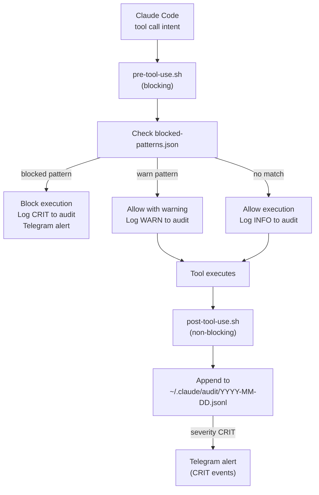

# WARD — Claude Code Security Hooks

**Status:** ✅ Active — INTenXDev + Ubuntu-AI-Hub
**Location:** `hooks/`
**Formerly:** SENTINEL

Every Claude Code tool call passes through WARD hooks. Pre-tool-use blocks dangerous operations; post-tool-use logs outcomes and sends Telegram alerts for critical events.

## Hook Execution Flow



## Installation

```bash
# Run on each WSL instance
bash ~/rtgf-ai-stack/hooks/install-hooks.sh

# Fill in Telegram credentials
nano ~/.claude/hooks/ward.env
# TELEGRAM_TOKEN=<bot-token>
# TELEGRAM_CHAT_ID=<admin-chat-id>
```

Hooks fire immediately on the next Claude Code session — no restart needed.

## Deployed Instances

| WSL Instance | Hooks | Telegram | `permissions.deny` |
|-------------|-------|----------|-------------------|
| INTenXDev | ✅ Active | ✅ Wired | ✅ 21 rules |
| Ubuntu-AI-Hub | ✅ Installed | ✅ Wired | ✅ 21 rules |

## Audit Digest

The bot sends a daily WARD security digest at **7:05am** alongside the platform health report.

```
*WARD Audit — 2026-03-05*
Tool calls: 403
🚫 Blocked: 1
  • curl-pipe-shell: 1
```

On-demand via Telegram:
```
/ward              — yesterday's digest
/ward 2026-03-04   — specific date
```

The `/ward` command is admin-only.

## Block Policy Format

`hooks/policy/blocked-patterns.json`:

```json
{
  "bash_patterns": [
    {
      "id": "rm-rf",
      "pattern": "rm\\s+(-\\S*r\\S*f|-rf|-fr)\\s",
      "action": "block",
      "message": "Destructive rm -rf blocked"
    },
    {
      "id": "git-force-push",
      "pattern": "git push.*(--force|-f)(?!-with-lease).*(main|master)",
      "action": "block",
      "message": "Force push to main/master blocked"
    },
    {
      "id": "git-reset-hard",
      "pattern": "git reset --hard",
      "action": "block",
      "message": "Hard reset blocked"
    },
    {
      "id": "bash-credential-file",
      "pattern": "(?m)^\\s*(cat|less|head|tail|strings|cp|mv)\\s+.*(etc/(passwd|shadow|sudoers)|~?\\.ssh/id_[a-z]|\\.aws/credentials|\\.pem|\\.key|\\.p12|\\.pfx)",
      "action": "warn",
      "message": "Credential/key file access — verify intent"
    }
  ]
}
```

The `bash-credential-file` pattern is anchored to `(?m)^\s*` to avoid false positives when Claude writes documentation or heredocs that mention these paths as examples.

## Audit Log

Each event appended to `~/.claude/audit/YYYY-MM-DD.jsonl`:

```json
{
  "timestamp": "2026-03-05T14:22:01.000Z",
  "session_id": "abc123def456",
  "tool": "Bash",
  "input": {"command": "git status"},
  "decision": "allow",
  "severity": "info",
  "matched_rule": null,
  "duration_ms": 145
}
```

## SOC 2 Relevance

The immutable JSONL audit trail is a foundation for SOC 2 evidence:

| SOC 2 Control | WARD Artifact |
|--------------|---------------|
| CC6.1 — Logical access | Virtual keys + block policies |
| CC6.8 — Unauthorized software | Block policies for destructive ops |
| CC7.1 — Detection & monitoring | JSONL audit log |
| CC7.2 — Evaluation of security events | Telegram CRIT alerts |
