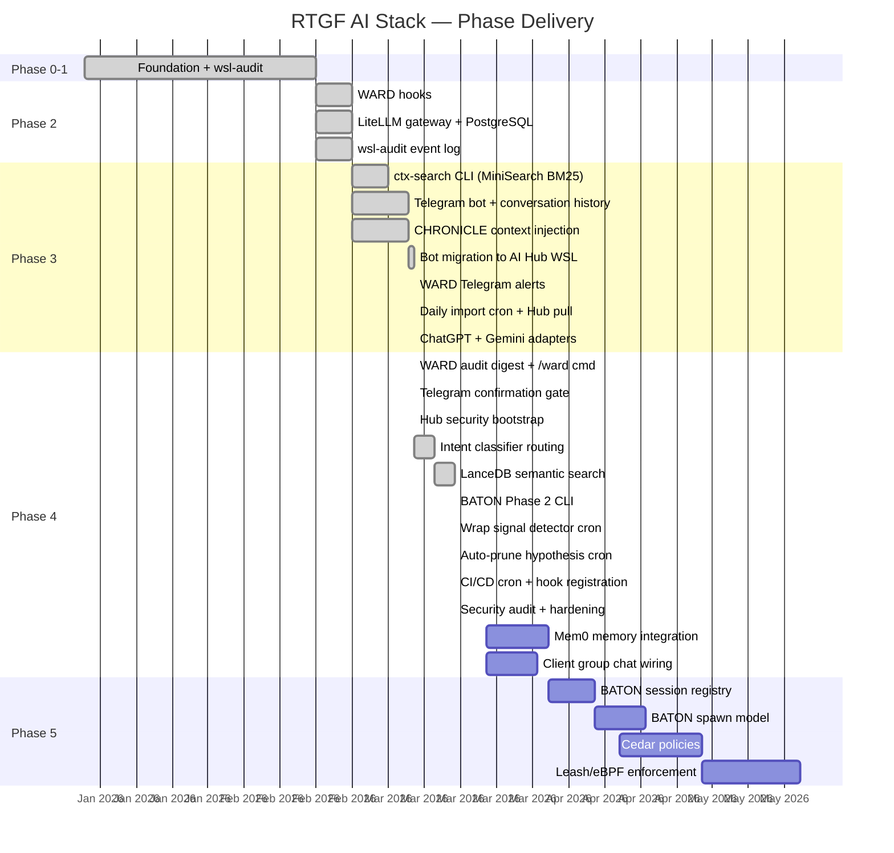

# Roadmap

## Phase Status

## Detailed Phase Breakdown

### ✅ Phase 0–1: Foundation
- Ollama running on Windows AMD GPU
- wsl-audit platform health tool
- CHRONICLE session archival (100+ sessions)
- Knowledge repos deployed (6 repos on GitHub INTenX org)
- LibreChat web UI

### ✅ Phase 2: Security Foundation
- WARD Claude Code hooks (`hooks/`)
- LiteLLM gateway deployed on Ubuntu-AI-Hub
- PostgreSQL backend for spend tracking
- Per-client virtual key isolation (`setup-client.sh`)
- wsl-audit event log + Telegram CRIT alerts
- CHRONICLE security fields (flow_state, quality_score)

### ✅ Phase 3: Context + Interface
- [x] ctx-search CLI (MiniSearch BM25)
- [x] Telegram bot with conversation history
- [x] CHRONICLE context injection in every LLM call
- [x] systemd service on Ubuntu-AI-Hub (survives reboots)
- [x] Self-healing gateway discovery
- [x] Bot migrated to AI Hub WSL alongside gateway
- [x] WARD Telegram block alerts (phone notification on block)
- [x] Daily CHRONICLE import cron (INTenXDev → GitHub → Hub pull)
- [x] ChatGPT import (`chronicle-import-chatgpt`)
- [x] Gemini import (`chronicle-import-gemini`)
- [x] LiteLLM client keys for intenx-dev ($100/mo) and sensit-dev ($50/mo)
- [x] /claude + /claudefast commands (Anthropic models, needs ANTHROPIC_API_KEY)

### ✅ Phase 4 (Partial): Operations + Automation
- [x] WARD daily audit digest (`/ward` command + 7:05am scheduled)
- [x] Telegram confirmation gate for `/pull` and `/import`
- [x] Hub security bootstrap (WARD hooks + permissions.deny + ward.env)
- [x] Intent classifier — automatic model routing (coding vs general vs fast) in bot
- [x] LanceDB semantic search layer for CHRONICLE
- [x] BATON Phase 2 — `baton` CLI (drop/list/claim/complete/show/abandon)
- [x] Wrap signal detector — hourly cron, Telegram alert on compaction/age/size
- [x] Auto-prune hypothesis sessions — weekly cron (30d stale, no curation)
- [x] CI/CD cron registration — all crons registered idempotently on deploy
- [x] Security audit + hardening — 6 shell injection fixes (`execFileSync` array form), `bash-credential-file` WARD pattern, path traversal guard in `check-mailbox`, frontmatter injection guard in MCP server
- [ ] Mem0 — semantic per-user memory (replaces flat `.chat-history.json`)
- [ ] Client group chat wiring (add team Telegram IDs to config.yaml)

### ⬜ Phase 5: BATON + Governance
- [ ] BATON session registry (`registry.json`) — live index of what's running
- [ ] BATON spawn model — `baton-spawn` via headless claude or tmux injection
- [ ] Cedar declarative RBAC policies
- [ ] Leash/eBPF kernel-level enforcement (gates on Cedar)

## Current Gaps

| Gap | Impact | Fix |
|-----|--------|-----|
| **GW-002** ANTHROPIC_API_KEY expired on Hub | `/claude` and `/claudefast` return auth error | Refresh key in `compose/gateway.env` on Ubuntu-AI-Hub, restart `litellm-gateway` |
| Client group chat IDs unknown | Can't route sensit-dev traffic to their key | Add bot to group, run `/whoami`, update `config.yaml` |
| BATON registry not built | Sessions can't discover each other | Phase 5: build registry.json + heartbeat integration |
| Mem0 not integrated | Per-user memory is flat JSON | Phase 5: swap `.chat-history.json` for Mem0 graph |
