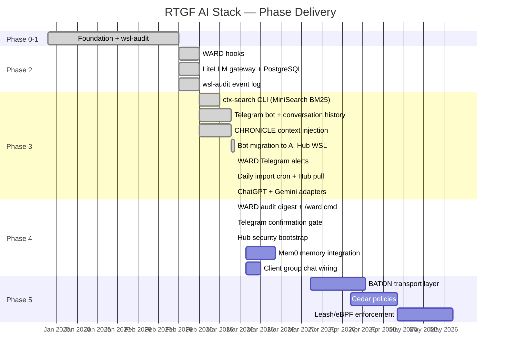

# Roadmap

## Phase Status

## Detailed Phase Breakdown

### ✅ Phase 0–1: Foundation
- Ollama running on Windows AMD GPU
- wsl-audit platform health tool
- CHRONICLE session archival (100+ sessions)
- Knowledge repos deployed (6 repos on GitHub INTenX org)
- LibreChat web UI

### ✅ Phase 2: Security Foundation
- WARD Claude Code hooks (`hooks/`)
- LiteLLM gateway deployed on Ubuntu-AI-Hub
- PostgreSQL backend for spend tracking
- Per-client virtual key isolation (`setup-client.sh`)
- wsl-audit event log + Telegram CRIT alerts
- CHRONICLE security fields (flow_state, quality_score)

### ✅ Phase 3: Context + Interface
- [x] ctx-search CLI (MiniSearch BM25)
- [x] Telegram bot with conversation history
- [x] CHRONICLE context injection in every LLM call
- [x] systemd service on Ubuntu-AI-Hub (survives reboots)
- [x] Self-healing gateway discovery
- [x] Bot migrated to AI Hub WSL alongside gateway
- [x] WARD Telegram block alerts (phone notification on block)
- [x] Daily CHRONICLE import cron (INTenXDev → GitHub → Hub pull)
- [x] ChatGPT import (`chronicle-import-chatgpt`)
- [x] Gemini import (`chronicle-import-gemini`)
- [x] LiteLLM client keys for intenx-dev ($100/mo) and sensit-dev ($50/mo)
- [x] /claude + /claudefast commands (Anthropic models, needs ANTHROPIC_API_KEY)

### ✅ Phase 4 (Partial): Operations
- [x] WARD daily audit digest (`/ward` command + 7:05am scheduled)
- [x] Telegram confirmation gate for `/pull` and `/import`
- [x] Hub security bootstrap (WARD hooks + permissions.deny + ward.env)
- [ ] Mem0 — semantic per-user memory (replaces flat `.chat-history.json`)
- [ ] Client group chat wiring (add team Telegram IDs to config.yaml)

### ⬜ Phase 5: BATON + Governance
- [ ] BATON inter-session handoff transport
- [ ] Cedar declarative RBAC policies
- [ ] Leash/eBPF kernel-level enforcement (gates on Cedar)

## Current Gaps

| Gap | Impact | Fix |
|-----|--------|-----|
| ANTHROPIC_API_KEY not set on Hub | `/claude` and `/claudefast` return error | Add to `gateway/.env`, restart gateway |
| Client group chat IDs unknown | Can't route sensit-dev traffic to their key | Add bot to group, run `/whoami`, update `config.yaml` |
| `ctx/archive/raw/` not gitignored | Knowledge repos grow with raw session files | Already fixed for `rcm/archive/raw/` — check `ctx/` path |
| Hypothesis sessions accumulate | Git repo size grows unbounded | Build auto-prune cron (>30 days) |
